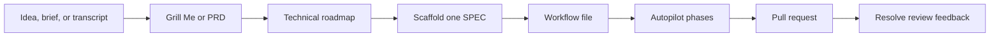

# SpecKit Pro

[](https://github.com/racecraft-lab/racecraft-plugins-public/blob/main/LICENSE)


SpecKit Pro is a Racecraft Lab plugin that wraps
[GitHub Spec Kit](https://github.github.io/spec-kit/) with practical agent
workflows for Claude Code and Codex.

In plain English: it helps turn a rough idea into a reviewed pull request by
making the agent slow down, ask better questions, write the spec, plan the work,
check for gaps, implement with tests, and leave a paper trail.

It does not replace Spec Kit. It adds opinionated coaching, scaffolding,
automation, and review helpers on top of the official Spec Kit workflow.

## Should I Install SpecKit Pro?

| Install it if... | Skip it if... |
|---|---|
| You want structured Spec-Driven Development instead of a single loose prompt. | You only need a one-line bug fix. |
| Your feature has ambiguous requirements, dependencies, or review risk. | You are intentionally prototyping without stable requirements. |
| You want a repeatable path from idea -> spec -> plan -> tasks -> PR. | You do not want a Spec Kit project structure in the repo. |
| You use Claude Code or Codex and want the same Racecraft workflow across both. | You are not using Claude Code, Codex, or GitHub Spec Kit. |

## What You Get

| Capability | What it means |
|---|---|
| Scoping interviews | `grill-me` asks one decision at a time before a spec is written. |
| SDD coaching | `speckit-coach` explains methodology, roadmaps, gates, and extension choices. |
| PRD and roadmap authoring | `speckit-prd` turns a broad idea into a PRD and SPEC catalog. |
| Spec scaffolding | `speckit-scaffold-spec` creates the worktree and workflow file for one SPEC. |
| Autopilot execution | `speckit-autopilot` runs the SDD phases toward an implementation PR. |
| Status and review helpers | `speckit-status` shows what is next; `speckit-resolve-pr` handles review comments. |
| Codex agent install support | `$install` copies bundled Codex custom-agent templates into Codex's agent registry. |

## Before You Install

You need:

- Claude Code or Codex
- GitHub Spec Kit installed from the official GitHub source
- A repository initialized for Spec Kit
- `gh` for PR creation and review-comment workflows
- `jq` for validation scripts

Spec Kit's official docs recommend installing from the GitHub repository. This
plugin's examples use the same GitHub source:

```bash
uv tool install specify-cli --from git+https://github.com/github/spec-kit.git
```

Initialize your repo with the Spec Kit integration for the agent you use. From
the project directory, the Claude Code setup is:

```bash
specify init --integration claude
```

For Codex or other integrations, follow the official
[Spec Kit installation guide](https://github.github.io/spec-kit/installation.html)
and [quick start](https://github.github.io/spec-kit/quickstart.html).

## Install

### Claude Code

```text
/plugin marketplace add racecraft-lab/racecraft-plugins-public
/plugin install speckit-pro@racecraft-plugins-public
/reload-plugins
```

Claude Code plugin skills are namespaced, so SpecKit Pro skills use the
`/speckit-pro:<skill>` form.

### Codex

Claude Code install commands are the separate DOC-003-owned path. For Codex,
open this marketplace repo in Codex, then open the plugin directory:

```text
codex
/plugins
```

Install SpecKit Pro from the repo marketplace. Codex reads the repo-scoped
marketplace from `.agents/plugins/marketplace.json`, and that marketplace points
the plugin at the generated payload in `dist/codex/speckit-pro/`. Do not install
Codex from the mixed authoring source tree at `speckit-pro/`.
For personal or local Codex setups, copy or sync `dist/codex/speckit-pro/` and
point `~/.agents/plugins/marketplace.json` at that copied payload.

Then run the Codex-only install skill to register the bundled Codex custom
agents:

```text
@SpecKit Pro -> install
```

or:

```text
$install
```

The default destination is `~/.codex/agents/`; `.codex/agents/` is the explicit
project-scoped destination override. Verify every installer-copied TOML file:

- `autopilot-fast-helper.toml`
- `phase-executor.toml`
- `clarify-executor.toml`
- `checklist-executor.toml`
- `analyze-executor.toml`
- `implement-executor.toml`
- `codebase-analyst.toml`
- `spec-context-analyst.toml`
- `domain-researcher.toml`
- `uat-runbook-author.toml`

Then restart Codex. Codex skills and custom agents are separate runtime
surfaces: the plugin ships skills directly, while the install skill copies the
named TOML templates into `.codex/agents/` or `~/.codex/agents/`.

Codex loads installed plugins from
`~/.codex/plugins/cache/$MARKETPLACE_NAME/$PLUGIN_NAME/$VERSION/`. Treat that
installed plugin cache as runtime state, not source of truth. If SpecKit Pro
looks stale after an update, inspect the marketplace source or copied personal
payload, the generated payload, the installed plugin cache, the selected
custom-agent destination, and whether Codex was restarted. Rerun
`@SpecKit Pro -> install` or `$install` after plugin updates that change bundled
custom-agent TOML files, then restart Codex.

Install safety is bounded here: Codex sandbox, approval, and network policy
still apply. Git-backed marketplace setup can require network access or network
approval, and the default `~/.codex/agents/` write is outside most project
workspaces. Approve only the expected local write of the named SpecKit Pro TOML
files, or rerun with `.codex/agents/` or narrower permissions. The generated
Codex payload can include lifecycle hook configuration such as
`codex-hooks.json`; hook behavior remains governed by Codex sandbox, approval,
hook trust, and configured policy controls.

For the detailed Codex install page, use
[`docs-site/src/content/docs/install/codex.md`](../docs-site/src/content/docs/install/codex.md).
DOC-007 owns deeper reference detail, and DOC-008 owns troubleshooting, update,
rollback, permission repair, stale-cache forensics, and full security or trust
depth.

## First Successful Workflow

Start with the lightest useful path. Use the Claude Code namespaced skill
invocations on the left or the Codex skill invocations on the right.

| Step | Claude Code | Codex |
|---|---|---|
| Get coached | `/speckit-pro:speckit-coach walk me through SDD` | `$speckit-coach walk me through SDD` |
| Scope a rough idea | `/speckit-pro:grill-me docs/raw-idea.md` | `$grill-me docs/raw-idea.md` |
| Create PRD and roadmap | `/speckit-pro:speckit-prd "saved searches"` | `$speckit-prd "saved searches"` |
| Check project status | `/speckit-pro:speckit-status` | `$speckit-status` |
| Prepare one SPEC | `/speckit-pro:speckit-scaffold-spec SPEC-001` | `$speckit-scaffold-spec SPEC-001` |
| Run autopilot | `/speckit-pro:speckit-autopilot docs/ai/specs/SPEC-001-workflow.md` | `$speckit-autopilot docs/ai/specs/SPEC-001-workflow.md` |

Before autopilot, define your project's constitution with the command installed
by Spec Kit for your runtime. The official Spec Kit workflow treats the
constitution as the rules the later phases should honor.

## How It Works



The core idea is simple:

1. Capture the decision context before implementation starts.
2. Convert that context into Spec Kit artifacts.
3. Run phase gates so ambiguity does not silently drift forward.
4. Implement only after the spec, plan, tasks, and analysis have enough detail.

## Skill Map

| Skill | Use it when... |
|---|---|
| `speckit-prd` | You have a broad product or technical idea and need a PRD plus SPEC catalog. |
| `speckit-coach` | You need SDD guidance, roadmap help, checklist domain advice, or gate troubleshooting. |
| `grill-me` | You need a one-question-at-a-time scoping interview before writing a spec. |
| `speckit-scaffold-spec` | A SPEC exists in the roadmap and needs a worktree plus populated workflow. |
| `speckit-autopilot` | A workflow file is ready to execute through the SDD phases. |
| `speckit-status` | You need project status, archive-sweep state, or the next recommended SPEC. |
| `speckit-resolve-pr` | A PR has review comments that should be addressed and pushed. |
| `install` | Codex needs the bundled custom-agent TOML templates copied into its agent registry. |

<details>
<summary><strong>Claude Code and Codex skill forms</strong></summary>

| Capability | Claude Code | Codex |
|---|---|---|
| PRD + roadmap authoring | `/speckit-pro:speckit-prd` | `$speckit-prd` |
| SDD coaching | `/speckit-pro:speckit-coach` | `$speckit-coach` |
| Iterative scoping interview | `/speckit-pro:grill-me` | `$grill-me` |
| Spec scaffolding | `/speckit-pro:speckit-scaffold-spec` | `$speckit-scaffold-spec` |
| Autopilot execution | `/speckit-pro:speckit-autopilot` | `$speckit-autopilot` |
| Project status | `/speckit-pro:speckit-status` | `$speckit-status` |
| PR review resolution | `/speckit-pro:speckit-resolve-pr` | `$speckit-resolve-pr` |
| Codex custom-agent install | Not applicable | `@SpecKit Pro -> install` or `$install` |

Some Codex environments also expose plugin skills through the `@SpecKit Pro`
picker. Explicit `$skill-name` invocation is the most predictable form.

</details>

## Configuration

Create `.claude/speckit-pro.local.md` for per-project settings:

```yaml
---
consensus-mode: moderate    # conservative | moderate | aggressive
gate-failure: stop          # stop | skip-and-log
auto-commit: per-phase      # per-phase | batch | none
---
```

| Setting | Options | Default | What it controls |
|---|---|---|---|
| `consensus-mode` | `conservative`, `moderate`, `aggressive` | `moderate` | How much agreement is needed before the workflow applies an answer automatically. |
| `gate-failure` | `stop`, `skip-and-log` | `stop` | What happens when a phase gate still fails after auto-fix attempts. |
| `auto-commit` | `per-phase`, `batch`, `none` | `per-phase` | When workflow artifacts are committed. |

## Best Fit

Use SpecKit Pro for:

- Multi-step features where requirements matter
- Work that should produce a readable design trail
- Teams standardizing on Spec-Driven Development
- Large changes that need roadmap sequencing
- Overnight or long-running implementation workflows that need phase gates

Avoid it for:

- Tiny code edits
- Pure exploration with no stable target outcome
- Repos where you are not ready to initialize Spec Kit
- Changes that should stay manual for security, compliance, or business reasons

## Contributor And Maintainer Path

SpecKit Pro has one authoring source and two generated install payloads.

| Area | Source path | Generated install path |
|---|---|---|
| Claude Code plugin | `speckit-pro/skills`, `speckit-pro/agents`, `speckit-pro/hooks`, `speckit-pro/.claude-plugin` | `dist/claude/speckit-pro/` |
| Codex plugin | `speckit-pro/codex-skills`, `speckit-pro/codex-agents`, `speckit-pro/codex-hooks.json`, `speckit-pro/.codex-plugin` | `dist/codex/speckit-pro/` |
| Shared scripts and docs | `speckit-pro/scripts`, `speckit-pro/README.md`, `speckit-pro/CHANGELOG.md` | copied into both payloads as needed |

When changing the plugin:

1. Edit the source tree under `speckit-pro/`.
2. Rebuild generated payloads:

   ```bash
   bash scripts/build-plugin-payloads.sh
   ```

3. Run structural validation while iterating:

   ```bash
   bash tests/speckit-pro/run-all.sh --layer 1
   ```

4. Run the default suite before opening a PR:

   ```bash
   bash tests/speckit-pro/run-all.sh
   ```

Do not hand-edit generated `dist/**` payloads as the source of truth. They are
committed so marketplace installs can fetch self-contained platform payloads,
but they should be regenerated from source.

## Official Docs Grounding

Platform behavior changes over time. These docs are the source for platform
claims; this repository is the source for Racecraft-specific implementation
details.

| Topic | Official docs |
|---|---|
| Claude Code plugins and marketplaces | [Create plugins](https://code.claude.com/docs/en/plugins), [Plugin marketplaces](https://code.claude.com/docs/en/plugin-marketplaces), [Plugins reference](https://code.claude.com/docs/en/plugins-reference) |
| Codex plugins, skills, and subagents | [Plugins](https://developers.openai.com/codex/plugins), [Build plugins](https://developers.openai.com/codex/plugins/build), [Skills](https://developers.openai.com/codex/skills), [Subagents](https://developers.openai.com/codex/subagents) |
| Spec Kit install and workflow | [Spec Kit docs](https://github.github.io/spec-kit/), [Installation](https://github.github.io/spec-kit/installation.html), [Quick start](https://github.github.io/spec-kit/quickstart.html), [CLI reference](https://github.github.io/spec-kit/reference/overview.html) |

## Troubleshooting

<details>
<summary><strong>Codex installed the plugin, but custom agents are missing</strong></summary>

Run the plugin install skill:

```text
@SpecKit Pro -> install
```

or:

```text
$install
```

Then restart Codex. The plugin ships Codex skills directly, but custom agents
must be copied into `.codex/agents/` or `~/.codex/agents/` before Codex can
spawn them by name. The expected installed output is the TOML files listed
in the Codex install section above.

If a plugin update changed bundled custom-agent TOML files, rerun
`@SpecKit Pro -> install` or `$install`, verify the selected destination, and
restart Codex again. If behavior still looks stale, check the marketplace source
or copied personal payload, the generated payload, the installed plugin cache,
the selected custom-agent destination, and restart state. Do not edit the
installed plugin cache; DOC-008 owns deeper stale-cache troubleshooting,
permission repair, update, and rollback procedures.

</details>

<details>
<summary><strong>Autopilot stops at a gate</strong></summary>

Read the gate output first. A gate failure usually means the spec, plan, tasks,
or analysis still has a real gap. Fix the artifact that owns the gap, then rerun
the phase or workflow.

</details>

<details>
<summary><strong>Workflow prompts still contain placeholders</strong></summary>

Run `speckit-scaffold-spec` for the target SPEC. The scaffold step populates the
workflow from the roadmap and design concept before autopilot runs.

</details>

<details>
<summary><strong>Claude Code prompts for every edit</strong></summary>

Plugin agents inherit the parent Claude Code session's permissions. If your
project policy allows it, start Claude Code with the permission mode you want
before running autopilot.

</details>

## Advanced Architecture

<details>
<summary><strong>Autopilot phases</strong></summary>

Autopilot executes the SpecKit Pro workflow as phase work with gates between
major artifacts:

| Order | Phase |
|---|---|
| 1 | Specify |
| 2 | Clarify |
| 3 | Plan |
| 4 | Checklist |
| 5 | Tasks |
| 6 | Analyze |
| 7 | Implement |
| 8 | Pull request |

The plugin adds Racecraft guardrails around the official Spec Kit phases:
archive-aware startup, multi-agent ambiguity handling, gate validation,
reviewability checks, and PR follow-through.

</details>

<details>
<summary><strong>Consensus model</strong></summary>

When a phase hits ambiguity, three perspectives can be consulted:

| Perspective | What it checks |
|---|---|
| Codebase analyst | What the current repository already does. |
| Spec-context analyst | What the constitution, roadmap, prior specs, and workflow say. |
| Domain researcher | What relevant documentation or industry practice suggests. |

Security-sensitive topics are escalated instead of being silently resolved.

</details>

<details>
<summary><strong>Codex packaging model</strong></summary>

Codex skills live under `codex-skills/` in source and are materialized under
`skills/` in the generated Codex payload. Skill-owned `agents/openai.yaml`
sidecars describe appearance and dependencies for the skill.

Custom Codex subagents are different. They are TOML templates under
`codex-agents/` and must be copied into Codex's runtime agent directories by the
`install` skill.

The repo-scoped Codex marketplace is `.agents/plugins/marketplace.json`, which
points at `dist/codex/speckit-pro/`. Personal or local Codex setups should copy
or sync that generated payload, not install from `speckit-pro/`. Codex then
loads the installed runtime copy from
`~/.codex/plugins/cache/$MARKETPLACE_NAME/$PLUGIN_NAME/$VERSION/`.

The generated Codex payload can also include lifecycle hook configuration such
as `codex-hooks.json`. DOC-004 keeps that as install-safety awareness only;
DOC-007 owns deeper reference detail, and DOC-008 owns hook trust,
troubleshooting, update, rollback, permission, stale-cache, and security depth.

</details>

## Author

[Racecraft Lab](https://github.com/racecraft-lab)

## License

[MIT](https://github.com/racecraft-lab/racecraft-plugins-public/blob/main/LICENSE)
